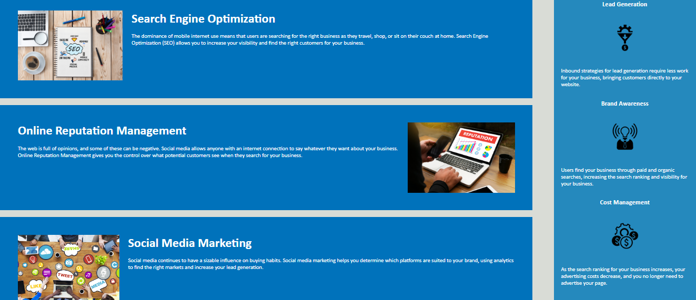

# 01 HTML CSS Git: Code Refactor

## The codebase for a marketing agency "Horiseon"
 
### What problem does it solve?

```
This page can be used as a codebase that follows accessibility standarts.
```

### What can you learn, creating it?

* How to structure database on page using HTML+CSS.
* How to create header with active references on main sections.
* How to create simple grid for putting blocks top, left, bottom and right.
* How to style paragraphs, headers, size and positions of images.
* How to make footer, to add few icons.

### The structure 

* The Horiseon webpage includes a navigation bar, a header image.

* Also webpage includes cards with text and images at the bottom of the page.

* The last one is a footer.


### View

The following image shows the web application's appearance and functionality:


